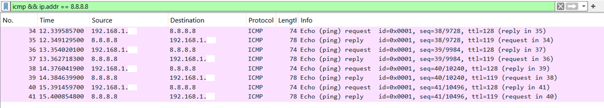
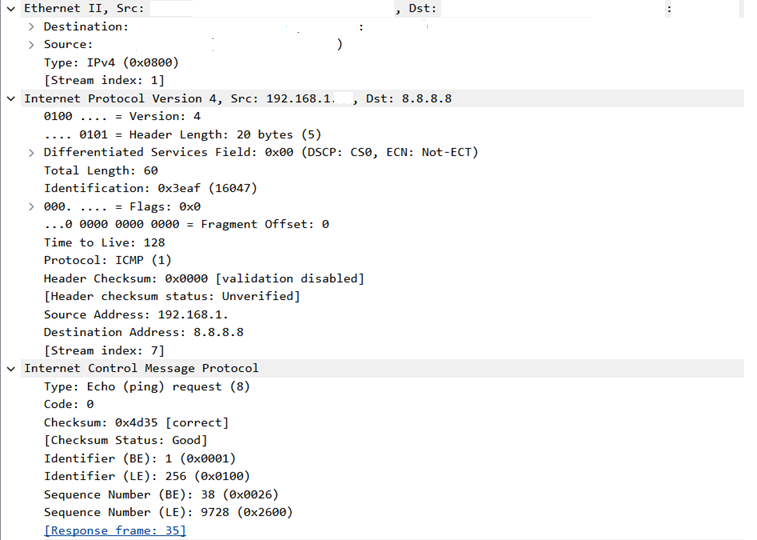

# 01 - ICMP / Ping

## Objetivo

Verificar conectividade IP com um destino externo usando o comando `ping` e analisar os pacotes ICMP no Wireshark.

## Ambiente

* Sistema operacional: Windows
* Terminal utilizado: Windows PowerShell (x86)
* Interface utilizada: Wi-Fi
* Ferramenta principal: Wireshark
* Rede utilizada: rede doméstica própria/autorizada
* VPN: desativada durante a captura

## Comando utilizado

```powershell
ping 8.8.8.8
```

## Filtro utilizado no Wireshark

```text
icmp && ip.addr == 8.8.8.8
```

## Evidências

### Filtro ICMP aplicado



### Detalhes do Echo Request



## O que foi observado

Durante a captura, foram observados pacotes ICMP entre o host local e o endereço `8.8.8.8`.

Foram identificados:

* pacotes **Echo Request** saindo do host local;
* pacotes **Echo Reply** retornando do destino;
* endereço IP de origem local;
* endereço IP de destino `8.8.8.8`;
* protocolo ICMP encapsulado em IPv4;
* campo TTL;
* tipo ICMP `Echo Request (8)`;
* tipo ICMP `Echo Reply (0)`;
* código `0`.

Nos detalhes do pacote, foi possível visualizar as camadas:

* Ethernet II;
* Internet Protocol Version 4;
* Internet Control Message Protocol.

## Análise técnica

O comando `ping` utiliza o protocolo ICMP para testar conectividade entre dois hosts.

Quando o host local envia um pacote **Echo Request**, ele espera receber um pacote **Echo Reply** do destino. Na captura realizada, foi possível observar esse comportamento: o host local enviou requisições ICMP para `8.8.8.8` e recebeu respostas do destino.

Esse comportamento indica que havia conectividade IP entre o host local e o destino externo testado.

Também foi possível observar que, embora o IP de destino fosse `8.8.8.8`, o quadro Ethernet utiliza endereços MAC relacionados à comunicação local. Isso reforça a diferença entre endereço IP, usado para identificar origem e destino lógico, e endereço MAC, usado na comunicação dentro do enlace local.

## Relação com redes e segurança defensiva

A análise de tráfego ICMP é útil em troubleshooting, redes, suporte técnico, NOC e SOC.

Esse tipo de análise pode ajudar a responder perguntas como:

```text
O host consegue alcançar o destino?
Existe resposta do destino?
O tráfego está saindo pela interface esperada?
O protocolo observado corresponde ao teste realizado?
```

Em segurança defensiva, entender tráfego ICMP ajuda a interpretar testes de conectividade, diagnosticar falhas de comunicação e reconhecer comportamentos básicos de rede.

## Observações importantes

Durante os testes iniciais, a VPN estava ativa e isso dificultou a visualização dos pacotes ICMP esperados na interface Wi-Fi.

A VPN foi desativada para a captura oficial, pois o tráfego poderia ser roteado por uma interface virtual, alterando o caminho dos pacotes e dificultando a análise.

Antes da publicação no GitHub, os prints devem ter informações sensíveis parcialmente ocultadas, como endereços MAC completos, nomes de dispositivos/fabricantes e, se necessário, IPs locais.

## Aprendizados

Nesta análise, foi possível praticar:

* uso do Wireshark para capturar tráfego ICMP;
* aplicação de filtros de exibição;
* identificação de pacotes Echo Request e Echo Reply;
* leitura de informações básicas em IPv4 e ICMP;
* diferença entre tráfego local em Ethernet e destino lógico em IP;
* importância de controlar variáveis do ambiente, como o uso de VPN.

## Conclusão

A captura mostrou com sucesso o funcionamento do comando `ping` na prática.

Foram observados pacotes ICMP Echo Request saindo do host local em direção ao endereço `8.8.8.8` e pacotes Echo Reply retornando do destino.

A análise confirmou conectividade IP com o destino externo e reforçou conceitos fundamentais de redes, como ICMP, IPv4, TTL, endereço de origem, endereço de destino e comunicação em camadas.
