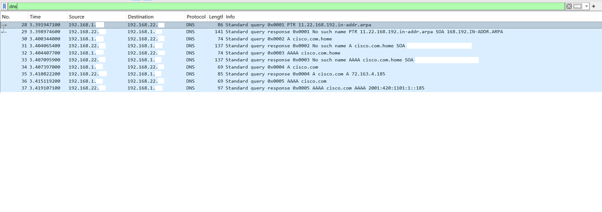
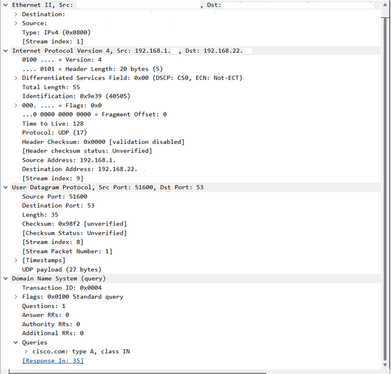
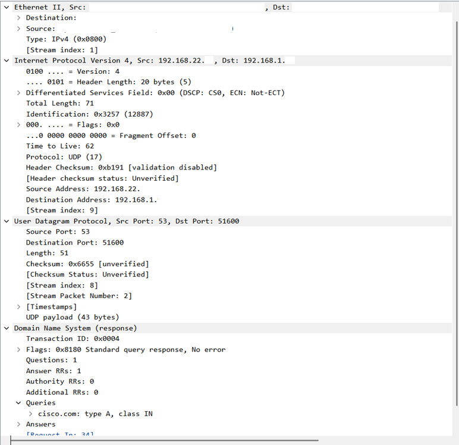
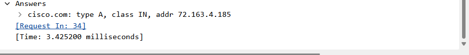

# 02 - DNS / nslookup

## Objetivo

Gerar uma consulta DNS utilizando o comando `nslookup` e analisar os pacotes DNS no Wireshark.

Nesta etapa, a ideia foi observar como um domínio é resolvido para um endereço IP e entender como essa consulta aparece no tráfego de rede.

## Ambiente

* Sistema operacional: Windows
* Terminal utilizado: Windows PowerShell (x86)
* Interface utilizada: Wi-Fi
* Ferramenta principal: Wireshark
* Rede utilizada: rede doméstica própria/autorizada
* VPN: desativada durante a captura

## Comando utilizado

```powershell
nslookup cisco.com
```

## Filtro utilizado no Wireshark

```text
dns
```

## Evidências

### Filtro DNS aplicado



### Detalhes da consulta DNS



### Detalhes da resposta DNS



### Resposta com registro A



## O que foi observado

Durante a captura, apareceram pacotes DNS entre o host local e o servidor DNS configurado na rede.

O comando `nslookup cisco.com` gerou uma consulta para resolver o domínio `cisco.com`. Na captura, foi possível observar a consulta saindo do host local e a resposta retornando do servidor DNS.

Foram identificados:

* consulta DNS saindo do host local;
* resposta DNS retornando do servidor DNS;
* uso do protocolo UDP;
* porta de destino `53` na consulta DNS;
* porta de origem `53` na resposta DNS;
* consulta DNS para o domínio `cisco.com`;
* registro do tipo `A`, relacionado a endereço IPv4;
* resposta DNS sem erro;
* endereço IPv4 `72.163.4.185` retornado para `cisco.com`;
* correspondência entre consulta e resposta por meio do Transaction ID.

Também apareceram consultas relacionadas a registros `A` e `AAAA`.

O registro `A` está relacionado a endereços IPv4, enquanto o registro `AAAA` está relacionado a endereços IPv6.

## Análise técnica

O DNS é o serviço responsável por traduzir nomes de domínio em endereços IP. Na prática, isso permite acessar um destino pelo nome, como `cisco.com`, em vez de depender diretamente do endereço IP.

Nesta captura, o host local enviou uma consulta DNS para o servidor configurado na rede. A consulta utilizou UDP com porta de destino `53`, que é a porta padrão do DNS.

A resposta voltou do servidor DNS para o host local usando a porta de origem `53` e uma porta temporária do lado do cliente.

A consulta analisada buscava um registro do tipo `A` para o domínio `cisco.com`. Esse tipo de registro retorna um endereço IPv4. Na resposta, o domínio foi resolvido para o endereço `72.163.4.185`.

Um detalhe importante foi o Transaction ID. A consulta e a resposta tinham o mesmo identificador, o que permite relacionar a resposta recebida com a consulta enviada anteriormente.

Esse ponto é útil porque, em uma rede real, um host pode fazer várias consultas DNS em pouco tempo. O Transaction ID ajuda a identificar qual resposta pertence a qual pergunta.

## Relação com redes e segurança defensiva

A análise de DNS é muito útil em troubleshooting, redes, suporte técnico, NOC e SOC.

Quando um usuário não consegue acessar um site ou sistema, o problema nem sempre está na conectividade. Às vezes, o host consegue acessar a rede, mas não consegue resolver nomes corretamente. Por isso, analisar DNS ajuda a separar problemas de conectividade de problemas de resolução de nomes.

Esse tipo de análise ajuda a responder perguntas como:

```text
O host está conseguindo consultar um servidor DNS?
O servidor DNS está respondendo?
Qual domínio foi consultado?
Qual endereço IP foi retornado?
A resposta DNS apresentou erro?
A consulta utilizou a porta esperada?
O comportamento observado faz sentido?
```

Em segurança defensiva, o DNS também é importante porque muitas investigações começam pelos domínios acessados por um host. Consultas para domínios suspeitos, respostas incomuns ou grande volume de consultas podem indicar comportamentos que precisam ser analisados com mais atenção.

## Observações importantes

Durante a captura, apareceram tentativas de resolução usando o sufixo local `.home`, como `cisco.com.home`.

Essas consultas retornaram resposta indicando que o nome não existia. Depois disso, a consulta direta para `cisco.com` foi realizada com sucesso.

Esse comportamento pode acontecer quando o sistema ou a rede tenta aplicar um sufixo DNS local antes de consultar o domínio externo diretamente.

Os prints utilizados na documentação foram anonimizados para ocultar informações sensíveis da rede local, como IP local, IP do servidor DNS interno/local, endereços MAC completos e nomes de dispositivos/fabricantes.

## Aprendizados

Nesta análise, pratiquei:

* uso do `nslookup` para gerar consultas DNS;
* captura de tráfego DNS no Wireshark;
* aplicação do filtro `dns`;
* identificação de consulta e resposta DNS;
* observação do uso de UDP;
* identificação da porta `53`;
* leitura de registros DNS do tipo `A`;
* diferença entre registros `A` e `AAAA`;
* interpretação de uma resposta DNS sem erro;
* relação entre consulta e resposta por meio do Transaction ID.

## Conclusão

A captura mostrou o funcionamento básico de uma consulta DNS.

Foi possível observar o host local consultando o servidor DNS para resolver o domínio `cisco.com`, utilizando UDP e porta `53`.

A resposta retornou sem erro e apresentou um endereço IPv4 associado ao domínio consultado.

Essa análise ajudou a reforçar conceitos importantes de redes, como resolução de nomes, DNS, UDP, porta 53, registros `A` e `AAAA`, além da importância do DNS em troubleshooting e segurança defensiva.