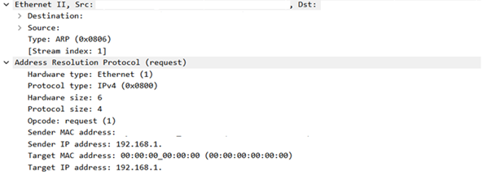
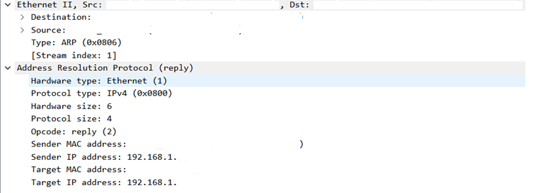

# 03 - ARP / Gateway

## Objetivo

Analisar pacotes ARP no Wireshark para entender como dispositivos de uma rede local associam endereços IP a endereços MAC.

A ideia desta etapa foi observar, na prática, como ocorre essa comunicação dentro da LAN e como o ARP participa da troca de informações entre o gateway e o host local.

## Ambiente

* Sistema operacional: Windows
* Terminal utilizado: Windows PowerShell (x86)
* Interface utilizada: Wi-Fi
* Ferramenta principal: Wireshark
* Rede utilizada: rede doméstica própria/autorizada
* VPN: desativada durante a captura

## Comandos utilizados

```powershell
ipconfig
arp -a
ping 192.168.1.1
```

## Filtro utilizado no Wireshark

```text
arp
```

## Evidências

### Filtro ARP aplicado


### Detalhes da requisição ARP



### Detalhes da resposta ARP



## O que foi observado

Durante a captura, apareceram pacotes ARP relacionados à comunicação entre o gateway e dispositivos da rede local.

No par de pacotes analisado com mais atenção, o gateway consultou qual endereço MAC estava associado ao IP do host local. Em seguida, o host local respondeu informando o MAC correspondente.

Foram identificados:

* uma requisição ARP com `Opcode: request (1)`;
* uma resposta ARP com `Opcode: reply (2)`;
* comunicação entre o gateway e o host local;
* uso do ARP para relacionar endereço IP e endereço MAC;
* campo `Target MAC address` preenchido com `00:00:00:00:00:00` na requisição;
* resposta ARP informando o endereço MAC associado ao IP consultado.

Também apareceram outras requisições ARP na rede, feitas pelo gateway para consultar diferentes endereços IP locais. Esse comportamento é esperado em uma rede em funcionamento.

## Análise técnica

O ARP, Address Resolution Protocol, é usado em redes IPv4 para descobrir qual endereço MAC está associado a determinado endereço IP dentro da rede local.

Essa relação é importante porque, na camada de rede, os dispositivos trabalham com endereços IP. Porém, dentro da LAN, a entrega dos quadros Ethernet depende dos endereços MAC.

Na captura principal desta etapa, o pacote analisado foi uma requisição ARP enviada pelo gateway. A mensagem consultava o endereço MAC associado ao IP do host local.

Um detalhe importante é que, nesse caso, o pacote não representou exatamente o cenário clássico em que o host local pergunta pelo MAC do gateway. Antes da captura, ao usar o comando `arp -a`, o gateway já aparecia na tabela ARP do host. Isso indica que o computador provavelmente já conhecia o MAC do gateway naquele momento.

Por isso, o fluxo observado foi o inverso: o gateway consultou o host local, e o host local respondeu.

Mesmo assim, a captura demonstra bem o funcionamento do ARP. Um dispositivo pergunta qual MAC está associado a um IP, e o dispositivo dono daquele IP responde com a informação correspondente.

Na requisição ARP, o campo `Target MAC address` apareceu como `00:00:00:00:00:00`. Isso acontece porque a requisição ainda está buscando essa informação. Já na resposta ARP, o endereço MAC associado ao IP consultado é informado.

## Relação com redes e segurança defensiva

Entender ARP é importante para redes, suporte técnico, infraestrutura, NOC e segurança defensiva.

Em troubleshooting, o ARP ajuda a investigar se os dispositivos estão conseguindo resolver corretamente os endereços MAC dentro da rede local. Isso pode ser útil ao analisar problemas de comunicação entre host, gateway, servidores e outros dispositivos da LAN.

Esse tipo de análise ajuda a responder perguntas como:

```text
Qual IP está associado a qual MAC?
O host conhece o MAC do gateway?
O gateway consegue identificar o host local?
Há muitas requisições ARP na rede?
O comportamento observado parece normal?
```

Em segurança defensiva, o ARP também é importante porque ataques como ARP spoofing e ARP poisoning exploram justamente essa associação entre IP e MAC. Por isso, entender o funcionamento normal do ARP é um passo importante para reconhecer comportamentos suspeitos no futuro.

## Observações importantes

Antes da captura, utilizei o comando `arp -a` para visualizar a tabela ARP local.

Como o endereço do gateway já estava presente nessa tabela, a captura não mostrou o host local perguntando pelo MAC do gateway. Em vez disso, o tráfego mais relevante capturado mostrou o gateway consultando o endereço MAC associado ao IP do host local.

Esse detalhe foi mantido na documentação porque representa o comportamento real observado na captura, em vez de forçar um exemplo idealizado.

Também foram observadas outras requisições ARP relacionadas a diferentes IPs da rede local. Essas mensagens não foram o foco principal da análise, mas ajudam a mostrar que o ARP é utilizado constantemente em redes locais.

## Aprendizados

Nesta análise, pratiquei:

* uso do comando `ipconfig` para verificar informações da interface de rede;
* uso do comando `arp -a` para visualizar a tabela ARP local;
* captura de tráfego ARP no Wireshark;
* aplicação do filtro `arp`;
* identificação de requisições e respostas ARP;
* interpretação do campo `Opcode`;
* diferença entre endereço IP e endereço MAC;
* relação entre ARP, gateway e comunicação dentro da LAN;
* importância de documentar o comportamento real observado, mesmo quando ele não segue exatamente o exemplo mais comum.

## Conclusão

A captura mostrou o funcionamento do ARP em uma rede local.

Foi possível observar uma requisição ARP feita pelo gateway para identificar o MAC associado ao IP do host local, seguida pela resposta ARP correspondente.

A análise ajudou a reforçar a diferença entre IP e MAC, o papel do ARP na LAN e a importância da tabela ARP na comunicação entre dispositivos da mesma rede.