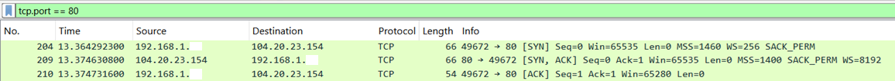
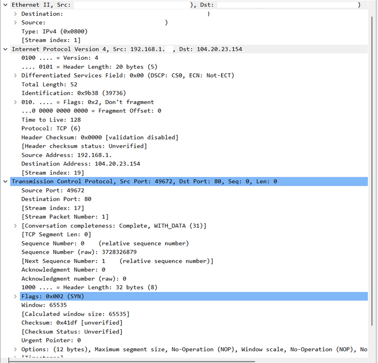
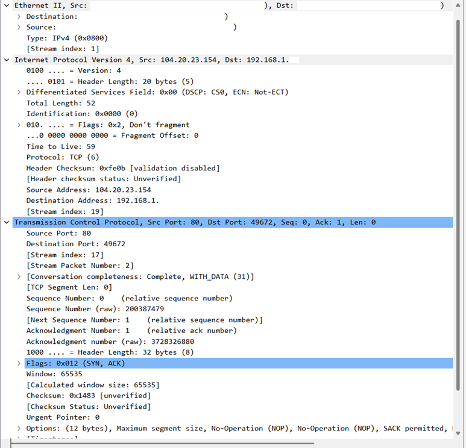
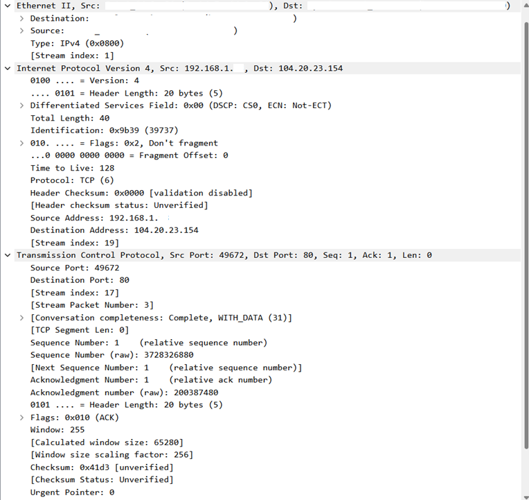

# 04 - TCP Handshake

## Objetivo

Analisar o processo de estabelecimento de uma conexão TCP observando o Three-Way Handshake no Wireshark.

Nesta etapa, a ideia foi identificar a sequência inicial de uma conexão TCP: `SYN`, `SYN/ACK` e `ACK`. Esse processo acontece antes da troca de dados entre cliente e servidor.

## Ambiente

* Sistema operacional: Windows
* Terminal utilizado: Windows PowerShell
* Interface utilizada: Wi-Fi
* Ferramenta principal: Wireshark
* Rede utilizada: rede doméstica própria/autorizada
* VPN: desativada durante a captura

## Comando utilizado

```powershell
curl.exe -4 http://example.com
```

## Filtro utilizado no Wireshark

```text
tcp.port == 80
```

## Evidências

### Filtro TCP aplicado



### Detalhes do pacote SYN



### Detalhes do pacote SYN/ACK



### Detalhes do pacote ACK



## O que foi observado

Durante a captura, foi possível observar o início de uma conexão TCP entre o host local e um servidor web na porta `80`.

A sequência principal observada foi:

* pacote `SYN` saindo do host local para o servidor;
* pacote `SYN, ACK` retornando do servidor para o host local;
* pacote `ACK` saindo do host local para o servidor.

Essa sequência representa o TCP Three-Way Handshake, processo usado para estabelecer uma conexão TCP antes da troca de dados da aplicação.

## Análise técnica

O TCP é um protocolo orientado à conexão. Isso significa que, antes de cliente e servidor trocarem dados de aplicação, eles precisam estabelecer uma conexão.

Na captura, o primeiro pacote da sequência foi o `SYN`, enviado pelo host local para o servidor na porta `80`. Esse pacote indica a intenção do cliente de iniciar uma conexão TCP.

Em seguida, o servidor respondeu com `SYN, ACK`. Esse pacote confirma o recebimento do `SYN` do cliente e também envia o próprio pedido de sincronização do servidor.

Por fim, o host local enviou um `ACK`, confirmando a resposta do servidor. Depois desse terceiro pacote, a conexão TCP foi considerada estabelecida.

A sequência pode ser resumida assim:

```text
Cliente → Servidor: SYN
Servidor → Cliente: SYN, ACK
Cliente → Servidor: ACK
```

Um detalhe importante observado foi o uso dos números de sequência e confirmação.

No primeiro pacote, o cliente iniciou com `Seq=0`. No segundo pacote, o servidor respondeu com `Ack=1`, confirmando o recebimento do `SYN`. No terceiro pacote, o cliente também enviou `Ack=1`, confirmando a resposta do servidor.

Esse comportamento mostra como o TCP usa números de sequência e confirmação para controlar o início da comunicação.

## Relação com redes e segurança defensiva

Entender o TCP Handshake é importante para redes, suporte técnico, infraestrutura, NOC e segurança defensiva.

Em troubleshooting, essa análise ajuda a verificar se uma conexão TCP está sendo estabelecida corretamente. Quando o cliente envia um `SYN`, mas não recebe `SYN, ACK`, por exemplo, isso pode indicar bloqueio, falha de conectividade, serviço indisponível ou filtragem por firewall.

Esse tipo de análise ajuda a responder perguntas como:

```text
O cliente tentou iniciar uma conexão?
O servidor respondeu?
A conexão TCP foi estabelecida?
A porta de destino está acessível?
Houve troca de dados após o handshake?
O comportamento observado faz sentido?
```

Em segurança defensiva, o TCP Handshake também é importante para entender conexões normais e identificar comportamentos suspeitos, como muitas tentativas de conexão, conexões incompletas, varreduras de porta ou possíveis sinais de SYN flood.

## Observações importantes

O comando utilizado foi `curl.exe -4 http://example.com`.

Foi usado `curl.exe` para evitar confusão com aliases do PowerShell, já que em algumas versões do Windows o comando `curl` pode se comportar de forma diferente.

O parâmetro `-4` foi usado para forçar o uso de IPv4 e facilitar a análise no Wireshark.

A porta analisada foi a porta `80`, associada ao tráfego HTTP. Por isso, além do TCP Handshake, também apareceu tráfego HTTP após o estabelecimento da conexão.

Os prints utilizados na documentação foram anonimizados para ocultar informações sensíveis da rede local, como IP local, endereços MAC completos e nomes de dispositivos/fabricantes.

## Aprendizados

Nesta análise, pratiquei:

* uso do `curl.exe` para gerar tráfego HTTP;
* captura de tráfego TCP no Wireshark;
* aplicação do filtro `tcp.port == 80`;
* identificação do TCP Three-Way Handshake;
* interpretação dos pacotes `SYN`, `SYN, ACK` e `ACK`;
* observação de portas de origem e destino;
* leitura de flags TCP;
* interpretação inicial de números de sequência e confirmação;
* relação entre TCP e tráfego HTTP;
* importância do handshake para estabelecer uma conexão antes da troca de dados.

## Conclusão

A captura mostrou o funcionamento do TCP Three-Way Handshake na prática.

Foi possível observar a sequência `SYN`, `SYN, ACK` e `ACK` entre o host local e um servidor web na porta `80`.

Depois do estabelecimento da conexão TCP, também foi observado tráfego HTTP, mostrando que a troca de dados da aplicação ocorreu após o handshake.

Essa análise ajudou a reforçar conceitos importantes de redes, como conexão TCP, portas, flags, números de sequência, confirmações e o papel do handshake na comunicação entre cliente e servidor.