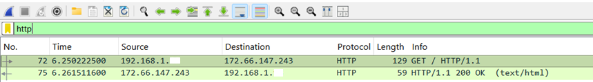
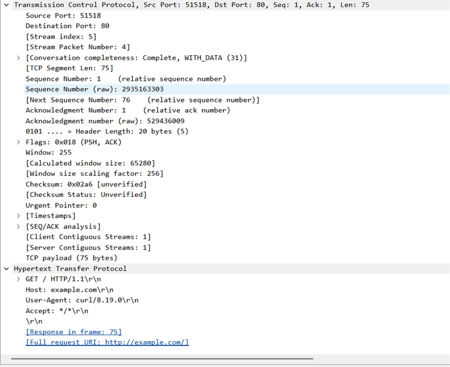
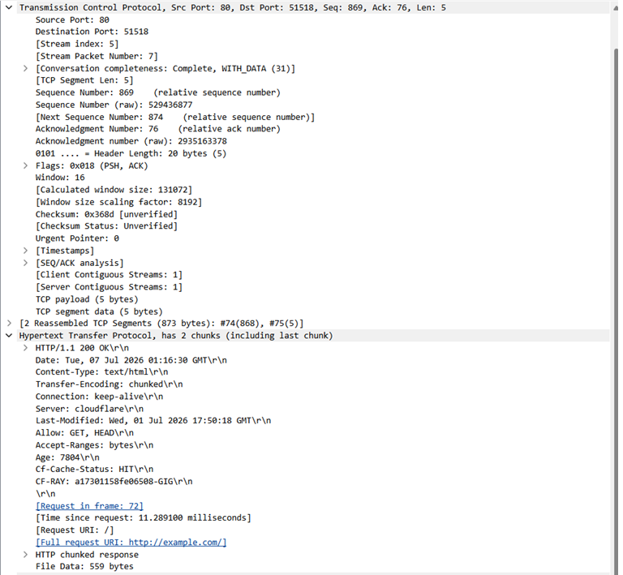
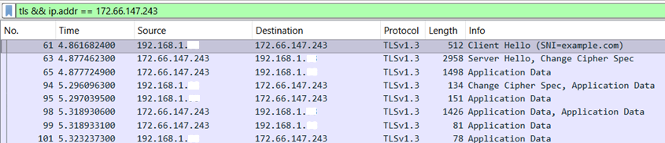
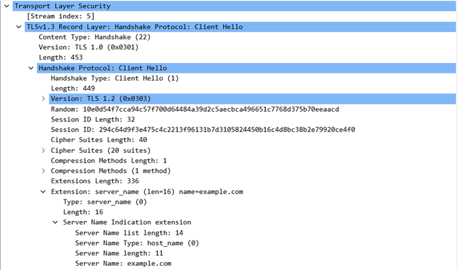
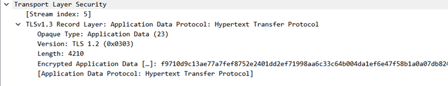

# 05 — HTTP vs HTTPS

## Objetivo

Nesta etapa, comparei o comportamento do tráfego HTTP e HTTPS no Wireshark.

A ideia foi observar, na prática, uma diferença importante entre os dois: no HTTP, a requisição e a resposta aparecem em texto claro. Já no HTTPS, a comunicação HTTP fica protegida por TLS, fazendo com que o conteúdo da aplicação apareça como dados criptografados.

Essa comparação é importante porque mostra por que o HTTPS é essencial para proteger informações transmitidas entre cliente e servidor.

---

## Ambiente

A captura foi feita em um ambiente local controlado, utilizando:

* Sistema operacional: Windows
* Terminal utilizado: Windows PowerShell
* Interface utilizada: Wi-Fi
* Ferramenta principal: Wireshark
* Rede utilizada: rede doméstica própria/autorizada
* VPN: desativada durante a captura

O tráfego foi gerado com o comando `curl.exe`, primeiro usando HTTP e depois HTTPS.

---

## Comandos utilizados

Para gerar tráfego HTTP:

```powershell
curl.exe -4 http://example.com
```

Para gerar tráfego HTTPS:

```powershell
curl.exe -4 https://example.com
```

O parâmetro `-4` foi utilizado para forçar o uso de IPv4 e facilitar a análise da captura.

---

## Filtros utilizados no Wireshark

Para observar o tráfego HTTP:

```text
http
```

Para observar o tráfego HTTPS/TLS:

```text
tls && ip.addr == 172.66.147.243
```

O segundo filtro foi usado para deixar a visualização mais limpa, mostrando apenas os pacotes TLS relacionados ao servidor acessado durante o teste.

---

## Evidência 1 — HTTP em texto claro

No primeiro teste, acessei o site usando HTTP.



Na captura, o Wireshark exibiu diretamente a requisição e a resposta HTTP:

```text
GET / HTTP/1.1
HTTP/1.1 200 OK
```

Isso mostra que, em uma comunicação HTTP comum, o conteúdo da requisição e da resposta pode ser lido diretamente na captura.

---

## Evidência 2 — Requisição HTTP

Ao analisar o pacote da requisição, foi possível visualizar informações como:

```text
GET / HTTP/1.1
Host: example.com
User-Agent: curl/8.19.0
Full request URI: http://example.com/
```



Esse ponto é importante porque mostra que o método HTTP, o host acessado e a URI aparecem de forma legível.

Em um cenário real, caso uma aplicação utilizasse HTTP para transmitir dados sensíveis, essas informações poderiam ser observadas por alguém com acesso ao tráfego da rede.

---

## Evidência 3 — Resposta HTTP

Também foi possível visualizar a resposta do servidor:

```text
HTTP/1.1 200 OK
Content-Type: text/html
Server: cloudflare
Full request URI: http://example.com/
```



A resposta `200 OK` indica que a requisição foi processada com sucesso pelo servidor.

Além disso, informações como tipo de conteúdo e servidor também aparecem em texto claro na captura.

---

## Evidência 4 — HTTPS usando TLS

No segundo teste, acessei o mesmo domínio usando HTTPS.



Diferente do HTTP, o Wireshark não mostrou diretamente uma requisição `GET / HTTP/1.1` nem uma resposta `HTTP/1.1 200 OK`.

Em vez disso, a captura exibiu pacotes relacionados ao TLS, como:

```text
Client Hello
Server Hello
Application Data
```

Isso mostra que, antes da troca de dados da aplicação, existe uma negociação TLS entre cliente e servidor.

---

## Evidência 5 — Client Hello e SNI

No pacote `Client Hello`, foi possível observar o início da negociação TLS.



Um detalhe importante observado foi o campo SNI:

```text
Server Name: example.com
```

O SNI indica qual nome de servidor o cliente deseja acessar durante a negociação TLS.

Isso mostra que, mesmo em HTTPS, alguns metadados da conexão ainda podem aparecer na captura. Porém, isso não significa que o conteúdo da requisição e da resposta HTTP esteja exposto.

---

## Evidência 6 — Application Data criptografado

Após a negociação TLS, os dados da aplicação passaram a aparecer como `Application Data`.



Na captura, o Wireshark exibiu:

```text
Encrypted Application Data
```

Esse é o ponto central da comparação.

No HTTP, foi possível visualizar diretamente:

```text
GET / HTTP/1.1
HTTP/1.1 200 OK
```

No HTTPS, esse conteúdo não apareceu em texto claro. Ele ficou protegido pelo TLS.

---

## Comparação entre HTTP e HTTPS

| Característica | HTTP | HTTPS |
|---|---|---|
| Porta comum | 80 | 443 |
| Criptografia | Não possui | Usa TLS |
| Requisição visível no Wireshark | Sim | Não, aparece protegida |
| Resposta visível no Wireshark | Sim | Não, aparece protegida |
| Exemplo observado | `GET / HTTP/1.1` | `Encrypted Application Data` |
| Proteção do conteúdo | Baixa | Alta |

---

## Análise técnica

HTTP é um protocolo de aplicação usado para comunicação entre cliente e servidor web. Quando utilizado sem criptografia, os dados trafegam em texto claro.

Na captura HTTP, foi possível observar diretamente o método `GET`, o host acessado, o `User-Agent` e a resposta `200 OK`.

HTTPS, por outro lado, utiliza HTTP sobre TLS. Isso significa que a comunicação HTTP continua existindo, mas fica protegida dentro de uma conexão criptografada.

Na captura HTTPS, o Wireshark mostrou o processo de negociação TLS, incluindo `Client Hello` e `Server Hello`. Depois disso, o conteúdo passou a aparecer como `Encrypted Application Data`.

Na prática, isso significa que alguém analisando o tráfego consegue perceber que existe uma conexão HTTPS com determinado servidor, mas não consegue ler diretamente a requisição e a resposta HTTP sem possuir as chaves necessárias para descriptografar a comunicação.

---

## Relação com redes e segurança defensiva

Essa análise é importante para redes, suporte e segurança defensiva porque ajuda a entender o que pode ou não ser observado em uma captura de tráfego.

Em HTTP, é possível analisar diretamente o conteúdo da comunicação, o que pode ajudar em troubleshooting, mas também representa um risco de segurança quando dados sensíveis são transmitidos.

Em HTTPS, o conteúdo fica protegido, o que aumenta a segurança para o usuário e para a aplicação. Porém, ainda é possível observar metadados úteis para investigação, como:

- IP de origem;
- IP de destino;
- porta utilizada;
- versão TLS;
- início da negociação;
- domínio indicado no SNI, quando visível;
- volume e direção dos pacotes.

Para uma análise defensiva, isso ajuda a responder perguntas como:

- Um host tentou acessar determinado domínio?
- A conexão foi feita usando HTTP ou HTTPS?
- Houve negociação TLS?
- O tráfego da aplicação estava criptografado?
- Existe comunicação com algum IP externo específico?

---

## Observações importantes

Durante a captura, alguns campos mostraram versões como TLS 1.0 ou TLS 1.2 dentro de uma comunicação identificada como TLS 1.3. Isso pode acontecer por questões de compatibilidade e formato dos campos usados durante a negociação TLS. Para esta análise, o mais importante não foi comparar versões específicas de TLS, mas observar a diferença prática entre HTTP em texto claro e HTTPS com dados criptografados.

Também é válido ressaltar que HTTPS protege o conteúdo da comunicação, mas não oculta todos os metadados. Informações como IPs, portas e parte da negociação TLS ainda podem ser observadas.

---

## Aprendizados

Com esta etapa, aprendi que:

- HTTP transmite requisições e respostas de forma legível;
- HTTPS utiliza TLS para proteger o conteúdo da comunicação;
- no HTTP, o Wireshark consegue mostrar `GET / HTTP/1.1` e `HTTP/1.1 200 OK`;
- no HTTPS, o conteúdo aparece como `Encrypted Application Data`;
- o `Client Hello` inicia a negociação TLS;
- o SNI pode indicar o domínio acessado, como `example.com`;
- criptografia protege o conteúdo, mas não elimina todos os metadados da conexão.

---

## Conclusão

A comparação entre HTTP e HTTPS deixou clara a importância da criptografia na comunicação web. No HTTP, a requisição e a resposta puderam ser lidas diretamente no Wireshark. Já no HTTPS, o conteúdo HTTP ficou protegido por TLS e apareceu na captura como dados de aplicação criptografados.

Essa etapa reforçou a diferença entre observar uma conexão e conseguir ler o conteúdo dela. Em segurança defensiva, essa distinção é importante, porque muitas análises dependem justamente de entender quais informações estão visíveis no tráfego e quais estão protegidas.