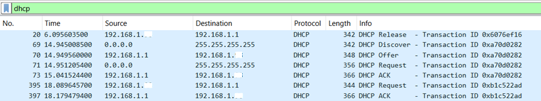
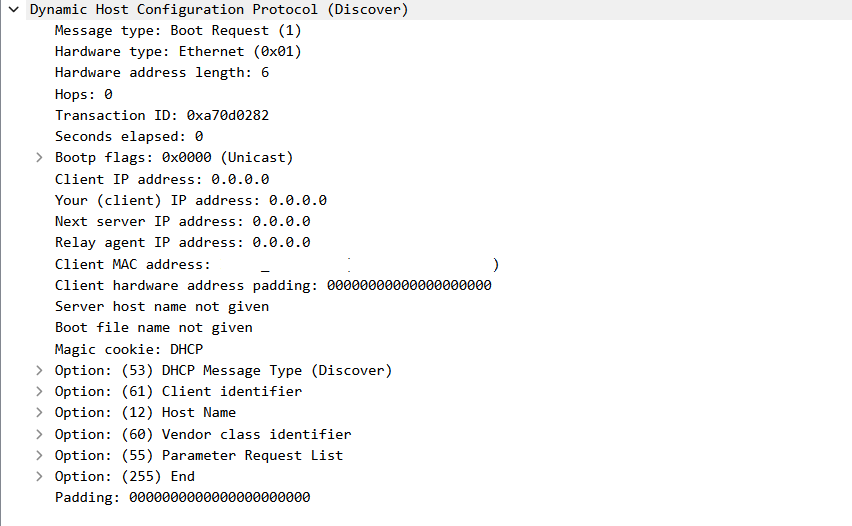
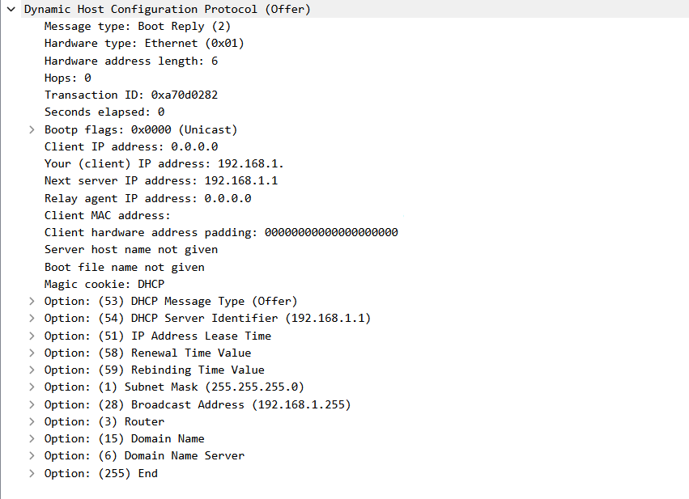
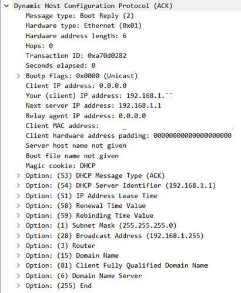

# 06 — DHCP

## Objetivo

Nesta etapa, analisei o funcionamento básico do DHCP no Wireshark.

A ideia foi observar como um host recebe automaticamente as configurações de rede necessárias para se comunicar, como endereço IP, máscara de sub-rede, gateway, DNS e tempo de lease.

Para gerar o tráfego DHCP, liberei a configuração de rede atual do Windows e depois solicitei uma nova configuração.

---

## Ambiente utilizado

A captura foi feita em um ambiente local controlado, utilizando:

- Windows;
- PowerShell;
- Wireshark;
- conexão via Wi-Fi;
- rede local com DHCP ativo.

O serviço DHCP, neste caso, foi fornecido pelo equipamento da rede local, responsável por entregar automaticamente as configurações de rede ao host.

---

## Comandos utilizados

Para liberar a configuração IP atual:

```powershell
ipconfig /release
```

Para solicitar novamente uma configuração de rede via DHCP:

```powershell
ipconfig /renew
```

O comando `ipconfig /release` fez o host liberar o endereço IP que estava em uso. Em seguida, o comando `ipconfig /renew` fez o host solicitar uma nova configuração ao servidor DHCP.

---

## Filtro utilizado no Wireshark

Para visualizar o tráfego DHCP, utilizei o filtro:

```text
dhcp
```

Esse filtro mostrou os pacotes DHCP trocados entre o host e o servidor DHCP da rede local.

---

## Evidência 1 — Filtro DHCP aplicado



Na captura, apareceram mensagens DHCP relacionadas ao processo de liberação e renovação da configuração de rede.

As principais mensagens observadas foram:

```text
DHCP Release
DHCP Discover
DHCP Offer
DHCP Request
DHCP ACK
```

O `DHCP Release` apareceu porque o host liberou a configuração anterior ao executar o comando `ipconfig /release`.

Depois disso, a sequência principal observada foi:

```text
Discover → Offer → Request → ACK
```

Essa sequência representa o processo clássico de obtenção de configuração via DHCP.

---

## Evidência 2 — DHCP Discover



O pacote `DHCP Discover` representa o início do processo de obtenção de configuração.

Nesse momento, o host ainda não possui um endereço IP válido para utilizar na rede. Por isso, na captura aparecem campos como:

```text
Client IP address: 0.0.0.0
Your (client) IP address: 0.0.0.0
```

Também foi observado o tipo da mensagem DHCP:

```text
Option: DHCP Message Type (Discover)
```

Na prática, esse pacote funciona como uma pergunta enviada pelo cliente para a rede local:

```text
Existe algum servidor DHCP disponível para me entregar uma configuração de rede?
```

Como o cliente ainda não sabe qual servidor DHCP está disponível, essa etapa normalmente utiliza broadcast na rede local.

---

## Evidência 3 — DHCP Offer



Após o `Discover`, o servidor DHCP respondeu com um `DHCP Offer`.

Nesse pacote, o servidor oferece uma configuração ao cliente. Entre as informações observadas, aparecem campos como:

```text
Your (client) IP address: 192.168.1.x
Option: DHCP Message Type (Offer)
Option: DHCP Server Identifier
Option: IP Address Lease Time
Option: Subnet Mask
Option: Router
Option: Domain Name Server
```

Esse pacote indica que o servidor DHCP encontrou uma configuração disponível e ofereceu um endereço IP ao host.

Além do IP, o DHCP também pode entregar outras informações importantes para a comunicação na rede, como gateway, máscara de sub-rede, DNS e tempo de concessão do endereço.

---

## Evidência 4 — DHCP Request


Depois de receber a oferta, o cliente enviou um `DHCP Request`.

Esse pacote representa a solicitação do cliente para usar a configuração oferecida pelo servidor DHCP.

Na captura, foram observados campos como:

```text
Option: DHCP Message Type (Request)
Option: Requested IP Address
Option: DHCP Server Identifier
```

Essa etapa confirma que o host deseja utilizar o endereço IP oferecido e reconhece qual servidor DHCP está participando do processo.

De forma simplificada, o cliente está dizendo:

```text
Quero usar esse endereço IP oferecido por esse servidor DHCP.
```

---

## Evidência 5 — DHCP ACK



O `DHCP ACK` foi a resposta final do servidor confirmando a configuração.

Nesse pacote, o servidor DHCP confirma que o cliente pode usar o endereço IP oferecido e as demais configurações de rede.

Na captura, apareceram campos como:

```text
Your (client) IP address: 192.168.1.x
Option: DHCP Message Type (ACK)
Option: DHCP Server Identifier
Option: IP Address Lease Time
Option: Subnet Mask
Option: Router
Option: Domain Name Server
```

Após essa confirmação, o host passa a utilizar a configuração recebida para se comunicar na rede.

---

## Fluxo observado

O fluxo principal observado foi:

| Etapa | Mensagem | Função |
|---|---|---|
| 1 | DHCP Discover | Cliente procura um servidor DHCP |
| 2 | DHCP Offer | Servidor oferece uma configuração |
| 3 | DHCP Request | Cliente solicita/aceita a configuração |
| 4 | DHCP ACK | Servidor confirma o uso da configuração |

Esse processo é conhecido como DORA:

```text
Discover
Offer
Request
Acknowledgment
```

---

## Análise técnica

O DHCP é usado para configurar automaticamente dispositivos em uma rede IP.

Sem DHCP, seria necessário configurar manualmente informações como endereço IP, máscara de sub-rede, gateway e DNS em cada dispositivo. Em redes pequenas isso já seria trabalhoso; em redes maiores, seria muito mais difícil manter controle e organização.

Na captura, o host iniciou sem um IP válido no processo de renovação, usando `0.0.0.0` nos campos de cliente. Em seguida, o servidor DHCP ofereceu uma configuração e o cliente solicitou o uso dela.

O servidor finalizou o processo com um `DHCP ACK`, confirmando que o endereço IP e as demais informações poderiam ser utilizadas.

Outro ponto importante é que o DHCP utiliza UDP, normalmente com as portas:

```text
UDP 67 — servidor DHCP
UDP 68 — cliente DHCP
```

Isso faz sentido porque, no início do processo, o cliente ainda não possui uma configuração completa de rede. Por isso, o DHCP usa um mecanismo simples de descoberta e resposta dentro da rede local.

---

## Relação com redes e troubleshooting

DHCP é um ponto muito importante em troubleshooting de rede.

Quando um dispositivo não consegue acessar a internet ou outros recursos da rede, uma das primeiras verificações é saber se ele recebeu uma configuração válida.

Alguns sinais de problema relacionado a DHCP seriam:

- host sem endereço IP válido;
- endereço APIPA, como `169.254.x.x`;
- ausência de gateway padrão;
- DNS incorreto ou ausente;
- conflito de IP;
- falha ao renovar o lease.

Um cenário comum seria:

```text
O usuário está conectado ao Wi-Fi, mas não acessa a internet.
```

Nesse caso, uma análise inicial poderia verificar:

```powershell
ipconfig
```

Depois, seria possível confirmar se o host recebeu:

```text
Endereço IPv4
Máscara de sub-rede
Gateway padrão
Servidor DNS
```

Se essas informações não estiverem corretas, o problema pode estar relacionado ao DHCP ou à configuração da rede local.

---

## Relação com segurança defensiva

Embora DHCP seja um protocolo de configuração, ele também tem relação com segurança defensiva.

Em uma rede corporativa, analisar eventos DHCP pode ajudar a responder perguntas como:

- quais dispositivos receberam IP na rede;
- quando um host entrou na rede;
- qual endereço IP foi atribuído a determinado dispositivo;
- se há dispositivos desconhecidos recebendo configuração;
- se existem conflitos ou comportamento incomum na distribuição de endereços.

Além disso, ataques ou problemas envolvendo DHCP podem afetar diretamente a disponibilidade da rede. Um servidor DHCP falso, por exemplo, poderia entregar configurações incorretas para clientes, apontando gateway ou DNS para destinos indevidos.

Por isso, entender DHCP ajuda tanto em suporte e infraestrutura quanto em análises defensivas.

---

## Observações de privacidade

Antes da publicação dos prints, algumas informações da rede local foram ocultadas ou parcialmente mascaradas.

Foram ocultados principalmente:

```text
MAC address do cliente
identificadores únicos do dispositivo
nome do host, caso aparecesse
```

Endereços IP privados foram mantidos parcialmente visíveis quando eram úteis para a análise, usando o formato:

```text
192.168.1.x
```

A intenção foi preservar o valor técnico da captura sem expor detalhes desnecessários da rede local.

---

## Aprendizados

Com esta etapa, observei que:

- o DHCP permite configurar automaticamente um host na rede;
- o fluxo principal é Discover, Offer, Request e ACK;
- o cliente pode iniciar o processo usando `0.0.0.0`, pois ainda não possui IP válido;
- o servidor DHCP oferece um endereço IP e outras configurações de rede;
- o cliente solicita o uso da configuração oferecida;
- o servidor confirma a configuração com um DHCP ACK;
- além do IP, o DHCP pode entregar máscara, gateway, DNS e tempo de lease;
- problemas em DHCP podem causar falhas de conectividade mesmo quando o dispositivo está conectado fisicamente ou ao Wi-Fi.

---

## Conclusão

A análise do DHCP mostrou como um dispositivo recebe automaticamente as configurações necessárias para participar de uma rede.

Na captura, foi possível observar o processo de liberação e renovação da configuração IP, incluindo a sequência `Discover → Offer → Request → ACK`.

Essa etapa complementa as análises anteriores do projeto, porque mostra o que acontece antes de muitos testes de conectividade. Antes de um host conseguir resolver nomes com DNS, enviar pacotes ICMP, estabelecer conexões TCP ou acessar páginas HTTP/HTTPS, ele precisa primeiro ter uma configuração de rede válida.

Entender DHCP ajuda a interpretar problemas comuns de conectividade e reforça a base necessária para suporte, infraestrutura e segurança defensiva.